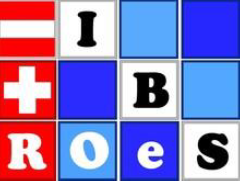

<center> <h1> Adaptive Designs and Multiple Testing Procedures Workshop </h1> </center>
<center> <h2> 19th - 21st April, 2023 </h2> </center>
---

```{r figurename, echo=FALSE, fig.cap="Pixabay Images", out.width = '60%', fig.align='center'}

```


We are delighted to announce the next annual workshop of the joint working group “Adaptive Designs and Multiple Testing Procedures” of the German (DR) and the Austrian-Swiss (ROeS) Regions of the International Biometric Society (IBS). The workshop will be organized jointly with the Basel Biometric Society.

**Where:** Novartis Campus, Basel, Switzerland. The workshop is planned as a **face-to-face event**, with no option to participate virtually.

**When:** The workshop will run from 19th April, 2023 (welcome at 13:00) until 21st April, 2023 (closing at 12:00).

**Invited Speakers:** We are delighted to announce that **Dr. Vlad Dragalin** (Janssen) and **Prof. Chris Jennison** (University of Bath) will present as invited speakers. The workshop will also feature an invited session on platform trials, with contributions from the EU-PEARL IMI Project.

**Registration:** Registration for the workshop is **now open** until 31st March, 2023. Please register by [<span style="color: blue"> **completing this form**</span>](https://forms.gle/w2LLYeVkPhzCstrj6). 

**Abstract Submission:** Abstract submission is **now open** until 10th February, 2023. Please submit your abstract [<span style="color: blue">**using this form**</span>](https://forms.gle/4ugvKo4Ueg6Pj7wA6).

**Local Organizing Committee:** Marisa Bacchi, Ekkehard Glimm, Lisa Hampson, Eliane Imfeld, Dominic Magirr, Anh Nguyen Duc, Robbie Peck

**Contact:** If you have any questions about the workshop, please e-mail [Lisa Hampson](mailto:lisa.hampson@novartis.com).

$$\\[0.1cm]$$

**We are grateful to acknowledge sponsorship from**:

{width=15%}
{width=25%}

$$\\[0.1cm]$$

**ORGANIZED BY**:

{width=13%}
{width=13%}


