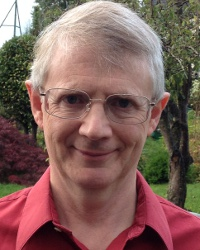
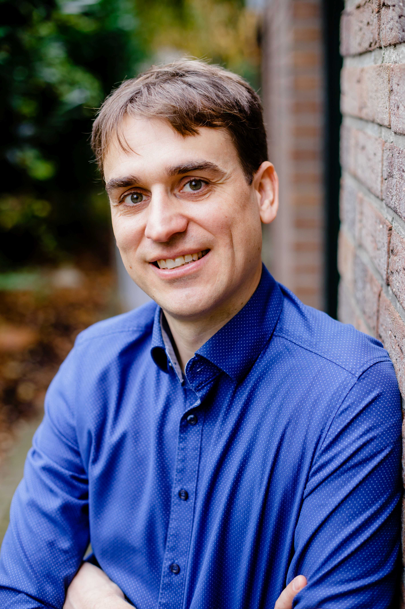

# Invited speakers

{width=40%, height=300px} {width=40%, height=300px}

## Professor Chris Jennison, University of Bath

*Optimising sequential and adaptive designs: the power of dynamic programming*

Christopher Jennison is Professor of Statistics at the University of Bath, UK. His PhD research at Cornell University concerned the sequential analysis of clinical trials and he has continued to work in this area for almost 40 years. His book with Professor Bruce Turnbull, "Group Sequential Methods with Applications to Clinical Trials", is a standard text on this topic and is widely used by practising statisticians. The second edition of this book, extended to cover adaptive designs, is finally nearing completion.

Professor Jennison's research is informed by experience of clinical trial analysis at the Dana Farber Cancer Institute, Boston, by service on data monitoring committees, and by a broad range of consultancy with pharmaceutical companies.

## Tobias Mielke, Janssen

*Adaptive Platform Trials: Complex and Innovative – but how Useful?*

Tobias works as Senior Scientific Director in Janssen’s internal statistical consulting group. Tobias joined Janssen in 2018 to support the planning and implementation of adaptive and complex innovative designs in Janssen across therapeutic areas. Since end of 2019, Tobias contributes as Janssen representative to the statistical methodology work-package of the IMI Project EU PEARL. Prior to joining Janssen, Tobias worked at ICON Clinical Research as statistical consultant and had the chance to gather through numerous consulting projects experience on late-phase adaptive study designs, dose-response modeling and multiplicity problems. Tobias was one of the architects of ADDPLAN DF, a software for the design, simulation and analysis of adaptive dose-finding studies using MCPMod. Within this role at ICON, Tobias particularly enjoyed to implement his (at that time) fresh learnings from his PhD into some adaptive dose-finding methods. Tobias has a PhD from University of Magdeburg (Germany) on the topic of model-based design of experiments for nonlinear mixed effects models.

# EU-PEARL Session on Platform Trials

- *Optimal allocation strategies in platform trials* by Marta Bofill Roig
- *NCC: An R-package for analysis and simulation of platform trials with non-concurrent controls* by Pavla Krotka
- *TBA* by Quynh Lan Nguyen
-	*Looking forward and benefiting from the past: Sample size estimation for new arms in platform trials* by Sonja Zehetmayer 

